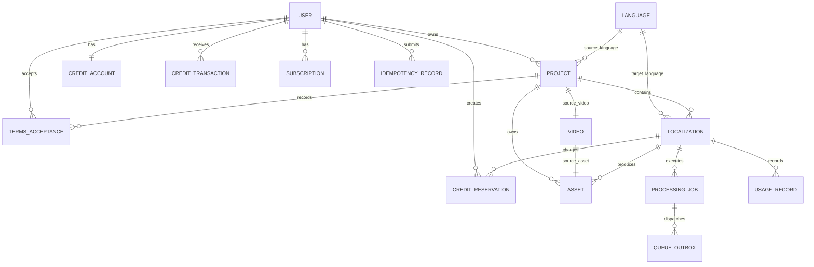

# AI Video Localization Platform — Implementation Plan

Document status: Proposed for review  
Product stage: MVP / V1  
Initial languages: English (`en`), Urdu (`ur`), Hindi (`hi`)  
Primary stack: Next.js, NestJS, TypeORM, PostgreSQL, Redis/BullMQ, FFmpeg, ElevenLabs  
Last updated: 2026-09-01

Implementation status (2026-09-01): Milestone 0 offline POC implemented. At the user's direction, it now also includes a local web UI/API for direct MP4 upload or safe public MP4 URL ingestion, language/provider selection, subtitle modes, logo placement/sizing, brightness, volume, progress, preview, and downloads. The production SaaS foundation remains deferred. Live acceptance remains blocked until a paid ElevenLabs key, three licensed source samples, and bilingual reviewers are available.

Approved Milestone 0 corrections:

- Use ElevenLabs Dubbing v2 project/language-target APIs.
- Treat the provider result as lossless audio, then mux it with the source video using FFmpeg.
- Generate UTF-8 SRT from the timed Dubbing v2 target transcript.
- Before exposing generation in the SaaS, implement credits, reservations, idempotency, and the transactional outbox.
- Add an immutable `LocalizationGeneration` model before implementing regeneration.

## 1. Purpose and delivery strategy

This plan converts the product requirements into an incremental implementation path for a production-ready AI video localization SaaS. The system will accept an uploaded video, generate an independently managed localization for a selected target language, apply lightweight media transformations, and provide private preview and download access.

The delivery order is deliberately risk-first:

1. Prove ElevenLabs can produce acceptable results for all six required language pairs.
2. Establish the monorepo, database, authentication, storage, queue, and observability foundations.
3. Build upload, analysis, project, and localization workflows.
4. Connect the complete asynchronous dubbing and FFmpeg pipeline.
5. Add credits before paid or unrestricted production generation.
6. Add Stripe only after per-minute costs and failure behavior are understood.
7. Harden security, recovery, scaling, and operations before production launch.

No UI, billing integration, or broad platform infrastructure should be built before the Phase 0 proof of concept passes.

## 2. Decisions, assumptions, and specification resolutions

### Adopted decisions

- TypeORM replaces Prisma throughout the project.
- PostgreSQL is the source of truth for durable application and workflow state.
- TypeORM migrations are mandatory; `synchronize` is disabled outside disposable tests.
- A `Project` owns one source video in V1 and can own many target `Localization` records.
- Generation is localization-scoped: `POST /localizations/:id/generate`.
- The browser uploads directly to private object storage using signed multipart URLs.
- API and worker applications are separate deployable processes.
- BullMQ jobs carry identifiers and immutable references, not large media or complete database objects.
- Generation settings are snapshotted as JSONB when generation is submitted.
- Raw source, provider, subtitle, thumbnail, logo, and final assets are separate immutable object-storage objects.
- UUIDs are used for public resource identifiers.
- Database timestamps are stored in UTC; the UI localizes them for display.
- Monetary values use integer minor currency units or fixed-precision database numerics, never floating point.

### Recommended initial choices

- Clerk for MVP authentication, subject to commercial approval. The backend still owns its internal `User` record.
- AWS S3 in production and MinIO for local development, both through `StorageProvider`.
- Vercel for Next.js and AWS ECS/Fargate for the API and media workers.
- AWS RDS PostgreSQL and ElastiCache Redis for the initial production environment.
- Noto Sans, Noto Sans Devanagari, and a verified Urdu Nastaliq font in the worker image.

These are deployment defaults, not domain dependencies. R2, another OpenID Connect auth provider, or another container platform can replace them through adapters/configuration.

### Resolved requirement conflicts

- The project-level generation endpoint in the narrative is replaced by the localization-level endpoint because each target has independent status, provider identifiers, cost, retries, and output.
- A minimal credit account, reservation, and ledger is part of the complete generation workflow. Stripe remains deferred. Development accounts may receive seeded credits.
- `Asset` is the canonical record for stored objects. Convenience asset relations may exist on `Video` and `Localization`; raw storage keys should not be duplicated across several domain tables.
- Project status describes source readiness and aggregate project condition. Localization status describes one target output. Processing-job status describes one technical job attempt.

### Gates requiring external validation

- Actual ElevenLabs support for every required source/target language pair.
- Whether speaker preservation meets quality expectations for Urdu and Hindi.
- Whether the selected ElevenLabs plan/API exposes timed transcripts or subtitles in a usable format.
- Maximum media size/duration, supported input containers, rate limits, concurrency, cancellation, and data-retention behavior.
- Provider terms for processing confidential/customer-owned material.

## 3. Proposed architecture

```text
Browser / Next.js
    |-- authenticated REST requests --> NestJS API
    |-- signed multipart upload ------> Private object storage
                                         |
NestJS API --> PostgreSQL <--------------+
    |             |
    |             +--> transactional queue outbox
    v
Redis / BullMQ <-- outbox dispatcher
    |
    +--> analysis worker ------> FFprobe / thumbnail generation
    +--> dubbing worker -------> ElevenLabs adapter
    +--> status worker --------> delayed provider polling
    +--> media worker ---------> FFmpeg / subtitle rendering
    +--> cleanup worker -------> object lifecycle/deletion
    +--> notification worker --> future email/webhooks

Workers --> private object storage --> signed preview/download URLs
All processes --> structured logs, metrics, traces, Sentry
```

### Architectural boundaries

- `DubbingProvider`: hides ElevenLabs request/response details and provider state names.
- `StorageProvider`: hides S3/R2/MinIO signing, multipart upload, object reads, writes, and deletion.
- `MediaProcessingService`: owns FFprobe/FFmpeg command construction and process execution.
- Domain services: own project, localization, state-transition, credit, and authorization rules.
- Queue producers/consumers: orchestrate durable asynchronous steps without embedding provider logic.
- TypeORM repositories: persistence only; business rules stay in services.

### Transaction and queue reliability

Database commits and Redis enqueues cannot share one atomic transaction. Generation and state-changing workflows will therefore write a `QueueOutbox` record in the same PostgreSQL transaction as the domain changes. A dispatcher publishes undispatched rows to BullMQ and marks them dispatched. Job handlers remain idempotent, so redispatch is safe.

## 4. Proposed monorepo

```text
AILocalization/
├── apps/
│   ├── web/                         # Next.js application
│   ├── api/                         # NestJS REST API and outbox dispatcher
│   ├── worker/                      # NestJS standalone BullMQ consumers
│   └── poc-elevenlabs/              # Phase 0 command-line proof of concept
├── packages/
│   ├── database/                    # TypeORM entities, migrations, seeds, DataSource
│   ├── contracts/                   # API/queue contracts and shared enums
│   ├── validation/                  # Shared Zod schemas where appropriate
│   ├── config/                      # Typed environment configuration
│   ├── storage/                     # StorageProvider and S3-compatible adapter
│   ├── dubbing/                     # DubbingProvider contracts and ElevenLabs adapter
│   ├── media/                       # FFprobe/FFmpeg services and safe process runner
│   ├── logger/                      # Structured logging and redaction
│   ├── test-utils/                  # Fixtures, containers, mocks
│   ├── eslint-config/
│   └── typescript-config/
├── infrastructure/
│   ├── docker/
│   └── deployment/                  # IaC added when deployment target is approved
├── docs/
│   ├── architecture/
│   ├── api/
│   ├── operations/
│   └── decisions/                   # ADRs
├── samples/                         # Metadata only; licensed videos kept out of Git
├── .env.example
├── docker-compose.yml
├── package.json
├── package-lock.json
├── turbo.json
└── README.md
```

Use npm workspaces and Turborepo for the post-POC monorepo unless the team selects another established tool before scaffolding.

## 5. Database ERD



## 6. TypeORM entity proposal

All entities use snake_case database names, UUID primary keys unless stated otherwise, `created_at`/`updated_at`, explicit foreign keys, and indexes for expected access paths. Soft deletion is limited to user-facing domain records; ledgers and audit records are immutable.

### User

- `id: uuid`
- `auth_provider: varchar(32)`
- `auth_provider_subject: varchar(191)`
- `email: varchar(320)` normalized for lookup
- `name: varchar(160) nullable`
- `status: ACTIVE | SUSPENDED | DELETED`
- `last_login_at: timestamptz nullable`
- timestamps and `deleted_at`
- unique: `(auth_provider, auth_provider_subject)`
- unique normalized email index where business policy permits

### Language

- `code: varchar(10)` primary key
- `name`, `native_name`
- `direction: LTR | RTL`
- `enabled: boolean`
- `sort_order: smallint`
- `provider_mapping: jsonb`
- timestamps

Language pairs are validated from enabled language records plus provider capability configuration. Source and target codes must differ.

### Project

- `id`, `user_id`
- `name: varchar(160)`
- `description: text nullable`
- `source_language_code`
- `status: DRAFT | UPLOADING | UPLOADED | ANALYZING | READY | FAILED | DELETING | DELETED`
- `source_video_id: uuid nullable`
- `version: integer` for optimistic concurrency
- timestamps and `deleted_at`
- indexes: `(user_id, created_at)`, `(user_id, status)`

### Video

- `id`, `project_id`, `source_asset_id`
- `original_filename`, `mime_type`, `container_format`
- `size_bytes: bigint`
- `duration_ms: bigint`
- `width`, `height`
- `fps_numerator`, `fps_denominator`
- `video_codec`, `audio_codec`
- `audio_channels`, `sample_rate nullable`
- `probe_data: jsonb` containing a sanitized FFprobe snapshot
- `analyzed_at nullable`
- timestamps
- unique: `project_id` for the V1 one-source-video rule

Milliseconds and rational FPS fields avoid floating-point timing drift.

### Asset

- `id`, `owner_user_id`, `project_id`
- `localization_id nullable`
- `kind: SOURCE_VIDEO | LOGO | THUMBNAIL | PROVIDER_OUTPUT | SUBTITLE | FINAL_VIDEO | TEMPORARY`
- `storage_provider`, `bucket`, `object_key`
- `original_filename nullable`, `mime_type`, `size_bytes nullable`
- `checksum_sha256 nullable`, `etag nullable`
- `status: PENDING_UPLOAD | AVAILABLE | QUARANTINED | DELETING | DELETED | FAILED`
- `metadata: jsonb`
- `retention_until nullable`
- timestamps
- unique: `(storage_provider, bucket, object_key)`
- indexes: `project_id`, `localization_id`, `(status, retention_until)`

### Localization

- `id`, `project_id`, `target_language_code`
- `status: DRAFT | READY | QUEUED | PREPARING_SOURCE | DUBBING | POST_PROCESSING | UPLOADING_RESULT | COMPLETED | FAILED | CANCEL_REQUESTED | CANCELLED`
- `progress: smallint` constrained to 0–100
- `current_stage: varchar(64) nullable`
- `provider: varchar(32)`
- `provider_project_id nullable`, `provider_language_id nullable`
- `settings_snapshot: jsonb nullable`
- `raw_output_asset_id nullable`
- `final_output_asset_id nullable`
- `subtitle_asset_id nullable`
- `error_code nullable`, `error_message_sanitized nullable`
- `generation_number: integer default 0`
- `started_at`, `completed_at`, `cancelled_at nullable`
- timestamps and `deleted_at`
- unique: `(project_id, target_language_code)` for V1
- indexes: `(project_id, status)`, provider identifier indexes

Regeneration creates a new generation attempt and new assets without overwriting prior objects. If product requirements later need retained version history, introduce `LocalizationGeneration` before supporting regeneration in production.

### ProcessingJob

- `id`, `localization_id`, `project_id`
- `bullmq_job_id nullable`
- `type: VIDEO_ANALYSIS | DUBBING_CREATE | DUBBING_POLL_SOURCE | DUBBING_CREATE_TARGET | DUBBING_POLL_TARGET | DOWNLOAD_PROVIDER_OUTPUT | POST_PROCESS | CLEANUP | NOTIFY`
- `status: PENDING | QUEUED | RUNNING | WAITING | SUCCEEDED | FAILED | CANCELLED`
- `progress`, `attempt_count`, `max_attempts`
- `idempotency_key`
- `payload_version`
- `last_error_code`, `last_error_sanitized`
- `scheduled_for`, `started_at`, `completed_at`, `heartbeat_at nullable`
- timestamps
- unique: `idempotency_key`
- indexes: `(status, scheduled_for)`, `(localization_id, created_at)`

### QueueOutbox

- `id`, `processing_job_id`, `queue_name`
- `payload: jsonb`, `payload_version`
- `available_at`, `dispatched_at nullable`
- `attempt_count`, `last_error_sanitized nullable`
- timestamps
- index: `(dispatched_at, available_at)`

### CreditAccount

- `user_id` primary/foreign key
- `available_credits: integer`
- `reserved_credits: integer`
- `version: integer`
- timestamps
- non-negative database constraints

### CreditReservation

- `id`, `user_id`, `localization_id`
- `credits: integer`
- `status: ACTIVE | CONSUMED | RELEASED | EXPIRED`
- `expires_at nullable`, `consumed_at nullable`, `released_at nullable`
- timestamps
- one active reservation per localization generation, enforced by migration-level index

### CreditTransaction

- `id`, `user_id`, `credit_reservation_id nullable`
- `type: PURCHASE | RESERVATION | CONSUMPTION | RELEASE | REFUND | ADMIN_ADJUSTMENT`
- `amount: integer` signed according to a documented ledger convention
- `available_balance_after`, `reserved_balance_after`
- `reference_type`, `reference_id`
- `description nullable`
- `created_at`
- indexes: `(user_id, created_at)`, `(reference_type, reference_id)`

Ledger rows are append-only. Corrections use compensating transactions.

### UsageRecord

- `id`, `user_id`, `project_id`, `localization_id`
- `source_duration_ms`, `billable_minutes`
- source and target language codes
- `provider`
- `provider_cost_minor nullable`, `processing_cost_minor nullable`, `currency nullable`
- `provider_usage: jsonb nullable`
- `created_at`
- unique by localization generation and usage type

### Subscription

- `id`, `user_id`
- `provider`, `provider_customer_id`, `provider_subscription_id`
- `plan_code`
- `status`
- `current_period_start`, `current_period_end`, `cancel_at_period_end`
- timestamps
- provider ID uniqueness constraints

### TermsAcceptance

- `id`, `user_id`, `project_id`
- `terms_type: CONTENT_RIGHTS | TERMS_OF_SERVICE | PRIVACY`
- `terms_version`
- `accepted_at`
- `ip_hash nullable`, `user_agent_summary nullable`
- unique according to `(user_id, project_id, terms_type, terms_version)`

### IdempotencyRecord

- `id`, `user_id`, `scope`, `idempotency_key`
- `request_hash`
- `status: IN_PROGRESS | COMPLETED | FAILED`
- `resource_type`, `resource_id nullable`
- `response_status nullable`, `response_body: jsonb nullable`
- `expires_at`, timestamps
- unique: `(user_id, scope, idempotency_key)`

### WebhookEvent and AuditEvent

Add durable webhook deduplication before Stripe integration and append-only audit events for security-sensitive actions such as generation, download signing, deletion, credit adjustment, and account administration.

## 7. TypeORM implementation rules

- Export one production `DataSource` from `packages/database` and inject repositories through NestJS.
- Keep entity decorators free of domain/service behavior.
- Use explicit migrations for enums, check constraints, partial indexes, extensions, and destructive changes.
- Use `QueryRunner` transactions for generation submission, credit reservation, and webhook processing.
- Lock the `CreditAccount` and relevant `Localization` row with a pessimistic write lock during generation submission.
- Use optimistic version columns for ordinary project/localization edits.
- Select only needed columns in list endpoints; never return provider secrets or raw probe/provider payloads.
- Use PostgreSQL `jsonb` for immutable settings snapshots and provider metadata, not for relational data that must be queried or constrained.
- Use `bigint` transformers carefully so byte sizes and millisecond durations do not silently lose precision in JavaScript.
- Never run `schema:sync` or `synchronize: true` against shared environments.

## 8. NestJS module structure

```text
AppModule
├── ConfigModule
├── DatabaseModule
├── LoggerModule
├── AuthModule
├── UsersModule
├── LanguagesModule
├── ProjectsModule
├── VideosModule
├── UploadsModule
├── AssetsModule
├── StorageModule
├── LocalizationsModule
├── DubbingModule
│   └── ElevenLabsModule
├── MediaProcessingModule          # worker imports implementation
├── JobsModule
├── QueueOutboxModule
├── CreditsModule
├── UsageModule
├── BillingModule                 # inactive until billing milestone
├── TermsModule
├── NotificationsModule
├── AuditModule
└── HealthModule
```

Controllers remain thin. Services perform authorization-aware domain operations. Provider adapters and storage adapters are injected through tokens so tests and future providers can replace them.

The worker application imports database, queues, storage, dubbing, media, usage, credits, and observability modules but exposes no public business API beyond health/metrics endpoints on a protected internal port if needed.

## 9. Next.js route and page structure

Use the App Router.

```text
app/
├── (public)/
│   ├── page.tsx
│   ├── pricing/page.tsx
│   └── auth/
│       ├── login/page.tsx
│       ├── register/page.tsx
│       └── forgot-password/page.tsx
├── (app)/
│   ├── layout.tsx
│   ├── dashboard/page.tsx
│   ├── projects/page.tsx
│   ├── projects/new/page.tsx
│   ├── projects/[projectId]/page.tsx
│   ├── projects/[projectId]/localize/page.tsx
│   ├── projects/[projectId]/localizations/[localizationId]/page.tsx
│   ├── billing/page.tsx
│   └── settings/page.tsx
├── error.tsx
└── not-found.tsx
```

TanStack Query owns server-state caching and polling. React Hook Form plus Zod handles forms. UI components should not contain language-pair rules or credit calculations; those values come from API resources and estimates.

## 10. REST API specification

All endpoints are versioned under `/api/v1`. Authentication is required unless marked public. Every resource lookup is scoped to the authenticated user.

### Identity and configuration

- `GET /me` — current internal user/profile.
- `PATCH /me` — update supported profile fields.
- `GET /languages` — enabled languages and directions.
- `GET /capabilities/language-pairs` — currently available provider-backed pairs.

### Projects

- `POST /projects` — create draft project.
- `GET /projects` — cursor-paginated filtered list.
- `GET /projects/:projectId` — project, source video, and localization summary.
- `PATCH /projects/:projectId` — edit mutable draft metadata.
- `DELETE /projects/:projectId` — mark deleting and queue storage cleanup.
- `POST /projects/:projectId/analysis` — idempotently request video analysis.

### Uploads and assets

- `POST /uploads/multipart` — initiate signed multipart upload.
- `POST /uploads/multipart/:uploadId/parts` — sign requested part numbers.
- `POST /uploads/multipart/:uploadId/complete` — validate parts and finalize upload record.
- `DELETE /uploads/multipart/:uploadId` — abort incomplete upload.
- `POST /projects/:projectId/logo-uploads` — initiate a constrained image upload.
- `DELETE /assets/:assetId` — delete an unused mutable asset.

### Videos and localizations

- `GET /videos/:videoId` — sanitized analyzed metadata.
- `POST /projects/:projectId/localizations` — create target localization.
- `GET /projects/:projectId/localizations` — list target versions.
- `GET /localizations/:localizationId` — details, settings, status, progress, assets.
- `PATCH /localizations/:localizationId/settings` — update draft settings.
- `POST /projects/:projectId/content-rights-acceptances` — record ownership confirmation.
- `POST /localizations/:localizationId/estimate` — authoritative credit estimate.
- `POST /localizations/:localizationId/generate` — reserve credits and enqueue generation; requires `Idempotency-Key`.
- `POST /localizations/:localizationId/cancel` — request cancellation where possible.
- `POST /localizations/:localizationId/regenerate` — later, after charging/versioning policy is approved.

### Jobs and results

- `GET /jobs/:jobId` — stage, progress, public error, timestamps.
- `GET /localizations/:localizationId/result` — result metadata and short-lived preview URL.
- `POST /localizations/:localizationId/download-url` — short-lived signed MP4 URL.
- `POST /localizations/:localizationId/subtitle-download-url` — signed SRT URL.

### Credits and billing

- `GET /credits` — available, reserved, and effective balance.
- `GET /usage` — cursor-paginated usage history.
- `GET /credit-transactions` — cursor-paginated ledger.
- `POST /billing/checkout-sessions` — later billing milestone.
- `POST /billing/webhooks/stripe` — public signature-verified webhook.
- `GET /billing/subscription` — current subscription.

### Operations

- `GET /health/live` — process liveness.
- `GET /health/ready` — critical dependency readiness.

Successful create endpoints return `201`; async acceptance returns `202`; delete scheduling returns `202`. API responses include a `requestId`. Pagination uses opaque cursors.

## 11. DTO definitions

DTOs use class-validator/class-transformer in NestJS. Shared enums and response contracts live in `packages/contracts`; frontend-only form validation may use matching Zod schemas.

### Core request DTOs

- `CreateProjectDto`: `name`, optional `description`, `sourceLanguageCode`.
- `UpdateProjectDto`: optional mutable `name`, `description`, `sourceLanguageCode`; rejected after analysis/generation when unsafe.
- `InitiateMultipartUploadDto`: `projectId`, `filename`, `mimeType`, `sizeBytes`, `assetKind`, optional SHA-256.
- `SignUploadPartsDto`: array of validated part numbers.
- `CompleteMultipartUploadDto`: storage upload token plus ordered `{partNumber, etag}` values.
- `CreateLocalizationDto`: `targetLanguageCode`.
- `LocalizationSettingsDto`:
  - `preserveVoice: boolean`
  - `subtitles.mode: NONE | FILE | BURNED`
  - `brightness: integer -50..50`
  - `volumePercent: integer 0..200`
  - optional `logo.assetId`, `position`, `sizePercent`
- `AcceptContentRightsDto`: exact `termsVersion` and affirmative `accepted: true`.
- `GenerateLocalizationDto`: optional expected estimate/version; authoritative values are recalculated server-side.
- `CancelLocalizationDto`: optional user-visible reason enum.
- `ProjectListQueryDto`: cursor, limit, status, search, sort.

### Response DTOs

- `ProjectSummaryDto`, `ProjectDetailDto`, `VideoMetadataDto`.
- `LocalizationSummaryDto`, `LocalizationDetailDto`.
- `GenerationEstimateDto`: duration, rounding policy, credits required, balance, canGenerate.
- `GenerationAcceptedDto`: `jobId`, `localizationId`, `status`, `creditsReserved`.
- `JobStatusDto`: stage-based progress and safe error representation.
- `AssetDownloadDto`: signed URL and expiry, never the bucket/key.
- `CreditBalanceDto` and `UsageRecordDto`.

Reject unknown fields, coerce only explicitly allowed query values, and cap all strings/arrays.

## 12. BullMQ queues and payloads

Queue names are versioned by configuration, while each payload contains an explicit schema version.

| Queue | Job | Purpose |
|---|---|---|
| `video-analysis` | `analyze-video.v1` | Download/stream source, FFprobe, thumbnail, persist metadata |
| `dubbing` | `create-provider-project.v1` | Submit one source to ElevenLabs |
| `dubbing-status` | `poll-source.v1` | Check non-blockingly for source readiness |
| `dubbing` | `create-language-target.v1` | Start requested target language |
| `dubbing-status` | `poll-target.v1` | Check target completion with delayed jobs |
| `dubbing` | `retrieve-output.v1` | Retrieve/store immutable provider output |
| `post-processing` | `render-final.v1` | Apply filters/subtitles and upload final result |
| `cleanup` | `delete-project-assets.v1` | Delete scheduled objects safely |
| `notifications` | `localization-completed.v1` | Future user/webhook notification |

Example minimal payload:

```ts
interface LocalizationJobPayloadV1 {
  version: 1;
  processingJobId: string;
  projectId: string;
  localizationId: string;
  generationNumber: number;
  correlationId: string;
}
```

Workers reload authoritative state and settings from PostgreSQL. Every handler verifies expected status/generation before side effects, records provider identifiers immediately after submission, and treats already-completed work as success.

Polling uses delayed jobs rather than sleeping workers. Initial delay is configurable around 15 seconds, then bounded exponential backoff with jitter. Provider concurrency is enforced globally through a verified BullMQ global limit or an explicit Redis semaphore; ordinary per-process worker concurrency alone is insufficient.

## 13. State machines

### Project

```text
DRAFT -> UPLOADING -> UPLOADED -> ANALYZING -> READY
  |          |            |           |
  +----------+------------+-----------+-> FAILED (recoverable when applicable)
READY/FAILED -> DELETING -> DELETED
```

Project completion is not a separate terminal state because one project may contain completed, processing, and failed localizations simultaneously. Dashboard aggregate state is derived.

### Localization

```text
DRAFT -> READY -> QUEUED -> PREPARING_SOURCE -> DUBBING
                                         -> POST_PROCESSING
                                         -> UPLOADING_RESULT
                                         -> COMPLETED

Any active state -> FAILED
Any cancellable active state -> CANCEL_REQUESTED -> CANCELLED
```

Only a central `LocalizationStateService` may transition states. Each transition defines allowed origins, persisted progress/stage, required fields, credit effect, and emitted outbox job.

### Processing job

```text
PENDING -> QUEUED -> RUNNING -> SUCCEEDED
                      |  |
                      |  +-> WAITING -> QUEUED
                      +----> FAILED
PENDING/QUEUED/WAITING -> CANCELLED
```

Provider statuses are mapped to internal outcomes and are never exposed as primary application states.

## 14. ElevenLabs adapter design

```ts
interface DubbingProvider {
  createProject(input: CreateDubbingProjectInput): Promise<ProviderProjectRef>;
  getProjectStatus(ref: ProviderProjectRef): Promise<ProviderStatus>;
  createLanguageTarget(input: CreateTargetInput): Promise<ProviderTargetRef>;
  getLanguageTargetStatus(ref: ProviderTargetRef): Promise<ProviderStatus>;
  downloadOutput(ref: ProviderTargetRef): Promise<ReadableStream>;
  getSubtitles?(ref: ProviderTargetRef): Promise<ReadableStream | null>;
  cancelProject(ref: ProviderProjectRef): Promise<CancelResult>;
  getCapabilities(): Promise<DubbingCapabilities>;
}
```

The ElevenLabs adapter owns authentication headers, request formats, status mapping, error classification, rate-limit parsing, response validation, and provider request IDs. It must not own credit or localization state rules.

Signed source URLs must remain valid for the provider ingestion window. Prefer a narrowly scoped signed URL with a validated safe expiry; if the API supports streaming upload, compare the security and reliability trade-offs during the POC.

Phase 0 records, for each language pair: request IDs, media duration, provider processing time, output size, speaker count, detected source language, subtitle availability, cost/usage, quality notes, and failure behavior.

## 15. Storage adapter design

```ts
interface StorageProvider {
  createMultipartUpload(input: CreateMultipartInput): Promise<MultipartRef>;
  signUploadPart(input: SignPartInput): Promise<SignedRequest>;
  completeMultipartUpload(input: CompleteMultipartInput): Promise<StoredObject>;
  abortMultipartUpload(ref: MultipartRef): Promise<void>;
  createReadUrl(ref: ObjectRef, ttlSeconds: number): Promise<string>;
  openReadStream(ref: ObjectRef): Promise<ReadableStream>;
  putStream(input: PutStreamInput): Promise<StoredObject>;
  headObject(ref: ObjectRef): Promise<ObjectMetadata>;
  deleteObject(ref: ObjectRef): Promise<void>;
}
```

Object keys are server-generated and contain opaque IDs, for example:

```text
projects/{projectId}/source/{assetId}/original.mp4
projects/{projectId}/localizations/{localizationId}/provider/{assetId}.mp4
projects/{projectId}/localizations/{localizationId}/final/{assetId}.mp4
projects/{projectId}/localizations/{localizationId}/subtitles/{assetId}.srt
projects/{projectId}/assets/{assetId}/logo.png
```

Buckets remain private. Upload completion verifies object existence, size, allowed type, and checksum where possible before marking an asset available. Signed URL TTLs are short and configurable. Project deletion creates auditable cleanup work rather than synchronously deleting objects in an API request.

## 16. FFmpeg processing architecture

`MediaProcessingService` exposes typed operations for analysis, thumbnail creation, normalization, and final rendering. It invokes `ffprobe`/`ffmpeg` with an argument array via a process runner; it never constructs an interpolated shell command.

### Render flow

1. Materialize input and required assets in a per-job temporary directory.
2. Validate all referenced assets and settings.
3. Build one filter graph where practical for brightness, logo scaling/position, audio volume, and subtitle burn-in.
4. Normalize container/codecs according to an explicit MP4 output profile.
5. Write to a temporary output file.
6. Probe and validate output duration, streams, dimensions, and file size.
7. Stream upload to immutable final storage.
8. Persist the asset and state transition transactionally.
9. Delete temporary files in `finally`, including failure/cancellation paths.

### Initial output profile

- MP4 container.
- H.264 video and AAC audio unless source passthrough is proven safe for a no-filter case.
- Preserve source dimensions/frame rate within approved limits.
- `faststart` for browser playback.
- Configurable CRF/preset and maximum resource limits.

### Unicode subtitles

- SRT files are stored separately in UTF-8.
- Burn-in uses FFmpeg compiled with libass and fontconfig.
- Docker image includes verified Urdu RTL and Hindi Devanagari fonts.
- Tests cover shaping, direction, punctuation, line wrapping, safe margins, and mixed Latin/native text.
- If FFmpeg/libass does not render Urdu acceptably, evaluate ASS generation or an approved preprocessing/rendering component before launch.

Resource limits include maximum duration, dimensions, file size, process timeout, disk quota, and worker CPU/memory. Workers must terminate child processes on cancellation or shutdown.

## 17. Credit and billing architecture

The centralized policy calculates billable credits from analyzed source duration. Initial recommendation: `ceil(duration_seconds / 60)` per localization, but the policy remains versioned and configurable.

### Generation transaction

1. Lock the localization and user credit account.
2. Validate ownership, source readiness, language pair, settings, terms, and no active generation.
3. Recalculate required credits server-side.
4. Verify available credits.
5. Move credits from available to reserved and append reservation ledger entries.
6. Snapshot settings and increment generation number.
7. Create processing job and outbox row.
8. Commit and return the accepted job.

On successful provider-backed generation, consume the reservation and write usage. On a clearly non-billable failure, release it. Ambiguous provider outcomes enter reconciliation rather than automatically granting repeated free attempts.

Stripe is introduced only after internal credit behavior works. Webhooks are signature-verified, deduplicated by provider event ID, processed transactionally, and treated as the source of truth for subscription/payment status. Checkout success redirects do not grant credits.

## 18. Authentication and authorization

### Authentication

- Clerk is the recommended initial identity provider.
- Next.js uses the provider session for UI access.
- NestJS validates signed JWTs using cached JWKS, issuer, audience, expiry, and algorithm restrictions.
- On first valid request or webhook synchronization, the backend upserts its internal user by provider subject.
- API clients never choose an internal `userId` in write DTOs.

If Auth.js is chosen instead, finalize the NestJS-verifiable token/session contract before implementation; do not share a browser-only session database implicitly.

### Authorization

- Default-deny guards require authentication.
- Service/repository queries scope resources by `user_id`; checking only that a UUID exists is insufficient.
- Child resources are authorized through project ownership.
- Signed download URLs are created only after fresh authorization.
- Future admin/support access requires explicit roles, audited impersonation rules, and least privilege.
- Object storage credentials are never issued to the browser; only narrowly scoped signed operations are returned.

## 19. Error model

Use RFC 9457-style problem details with stable application codes:

```json
{
  "type": "https://docs.example.com/errors/insufficient-credits",
  "title": "Insufficient credits",
  "status": 409,
  "code": "INSUFFICIENT_CREDITS",
  "detail": "This localization requires 8 credits.",
  "requestId": "...",
  "errors": []
}
```

Initial codes include validation/auth/not-found/conflict codes plus `INVALID_VIDEO`, `UNSUPPORTED_FORMAT`, `LANGUAGE_PAIR_INVALID`, `OWNERSHIP_CONFIRMATION_REQUIRED`, `INSUFFICIENT_CREDITS`, `GENERATION_ALREADY_ACTIVE`, `PROVIDER_RATE_LIMIT`, `PROVIDER_TIMEOUT`, `PROVIDER_FAILED`, `STORAGE_ERROR`, `FFMPEG_ERROR`, `SUBTITLE_RENDER_ERROR`, and `PROCESSING_TIMEOUT`.

Raw provider messages, signed URLs, stack traces, commands, and secrets are not returned to users. Internal error records retain sanitized diagnostic context and correlation/provider request IDs.

## 20. Retry, timeout, and cancellation strategy

- Retry network resets, 408/429/5xx responses, transient storage errors, and explicitly temporary provider states.
- Do not retry invalid media, unsupported pairs, validation failures, authentication failures, or deterministic FFmpeg errors without a changed input.
- Apply exponential backoff with jitter and honor provider `Retry-After` when safe.
- Configure attempt limits by job type rather than one global value.
- Polling is a normal delayed state, not a failed retry attempt.
- Set separate connect, response, provider-operation, render, and overall workflow timeouts.
- Jobs with expired heartbeats are reconciled by a scheduled recovery process.
- Cancellation is best effort: stop unstarted work, invoke provider cancellation if supported, terminate local FFmpeg, and apply the approved credit policy.

## 21. Idempotency strategy

- Require an `Idempotency-Key` header for generation, checkout, and other chargeable commands.
- Store a normalized request hash; reuse with different input returns a conflict.
- Lock the localization and enforce one active generation/reservation with database indexes.
- Persist provider IDs before scheduling polling.
- Use deterministic technical job idempotency keys such as `{localizationId}:{generation}:create-target`.
- Consumers check durable state before external side effects and safely acknowledge duplicate deliveries.
- Object keys contain asset IDs so retries do not overwrite originals.
- Stripe events are deduplicated by event ID.
- Outbox dispatch may occur more than once; logical effects remain exactly once through database constraints and handlers.

## 22. Logging, observability, and operations

- Emit structured JSON logs with `requestId`, `correlationId`, `userId`, `projectId`, `localizationId`, `processingJobId`, BullMQ job ID, provider request ID, and provider project ID where applicable.
- Redact authorization headers, cookies, API keys, signed URLs, webhook secrets, and sensitive query strings.
- Integrate Sentry in web, API, and worker applications with environment/release tags.
- Collect metrics for API latency/error rate, queue depth/age, active provider jobs, polling duration, render duration, success/failure by stage/language pair, credits reserved, storage bytes, and provider/compute cost per source minute.
- Add alerts for queue backlog, stalled jobs, repeated provider failure, credit reconciliation drift, storage failure, high error rate, and readiness failure.
- Health checks distinguish liveness from readiness. Worker readiness verifies required binaries/fonts/configuration.
- Define operational runbooks for stuck jobs, provider outage, credit reconciliation, object cleanup, and failed deployment.

## 23. Security and privacy controls

- Private encrypted storage; TLS in transit; managed encryption at rest.
- Secrets only in a secrets manager/environment injection, never Git or frontend bundles.
- Strict authentication and ownership checks on every resource.
- Allowlisted media/image MIME types plus magic-byte/FFprobe validation; never trust extension or browser MIME alone.
- Configurable maximum upload size, duration, resolution, frame rate, and multipart part count.
- Malware/content scanning strategy must be selected before public launch; unverified assets remain quarantined.
- Rate limits by IP, user, and costly action.
- Validation pipe with whitelist and forbidden unknown fields.
- Secure HTTP headers, restrictive CORS, CSRF protection where cookie authentication applies, and CSP for the web app.
- FFmpeg runs as non-root in an isolated container with limited CPU, memory, disk, no unnecessary network, and no shell interpolation.
- Temporary media uses per-job directories and is deleted after processing.
- Account/project deletion is asynchronous, auditable, retryable, and covers database visibility plus storage cleanup.
- Define privacy notice, retention matrix, backup retention/deletion limitations, and incident-response ownership before launch.
- Audit generation, signed downloads, deletions, terms acceptance, authentication changes, billing webhooks, and credit administration.

## 24. Testing strategy

### Unit tests

- Language-pair validation and configuration.
- Credit rounding, reservation, consumption, release, and concurrent balance behavior.
- Localization/project state transition matrices.
- Provider status/error mapping.
- FFmpeg argument/filter graph generation and escaping.
- Settings validation and snapshots.
- Idempotency-key behavior.

### Integration tests

- TypeORM repositories/migrations against real PostgreSQL.
- BullMQ/outbox behavior against real Redis.
- Multipart upload/signing against MinIO or an isolated test bucket.
- ElevenLabs adapter against a mock HTTP server and captured schema-compatible fixtures.
- FFprobe/FFmpeg against small licensed fixtures.
- Auth guard with signed test JWTs.
- Credit locking under concurrent generation requests.

### End-to-end tests

- Register/login test-user path where automation is supported.
- Create project, multipart upload, analyze, create localization, accept terms, estimate, generate, poll, preview, and download.
- Insufficient credits, duplicate generation, invalid format, provider transient failure, permanent failure, retry, cancellation, and deletion.
- Cross-tenant access attempts return non-disclosing denial/not-found behavior.

Provider calls are mocked in ordinary CI. A separately controlled manual/credentialed evaluation suite runs against ElevenLabs and never runs on untrusted pull requests.

### Localization quality suite

Maintain a licensed evaluation set covering all six pairs, single/multiple speakers, genders, music, fast speech, names/brands, technical terms, long form, Urdu RTL subtitles, and Hindi subtitles. Record repeatable human scores for translation, pronunciation, speaker similarity, sync, background preservation, and subtitle timing/rendering.

## 25. Docker and local development

`docker-compose.yml` provides PostgreSQL, Redis, MinIO, API, worker, and optional web services. Application code may run on the host for faster frontend/backend development.

Images:

- `api`: minimal Node LTS runtime, non-root user, production dependencies only.
- `worker`: Node LTS plus pinned FFmpeg/FFprobe build, libass/fontconfig, and pinned font files.
- `web`: Next.js standalone output or Vercel deployment.

Local setup must include:

1. Copy `.env.example` to a local ignored file.
2. Start PostgreSQL, Redis, and MinIO.
3. Run TypeORM migrations and language/dev-credit seeds.
4. Start API, worker, and web applications.
5. Run health and a mocked smoke workflow.

Pin Node, npm, FFmpeg, and image versions. Add startup checks for FFmpeg/FFprobe and required fonts.

## 26. Production deployment architecture

Recommended first production topology:

- Next.js on Vercel.
- NestJS API on ECS/Fargate behind an HTTPS load balancer.
- Dedicated ECS/Fargate worker services for provider/status jobs and CPU-heavy media jobs.
- RDS PostgreSQL with automated backups, point-in-time recovery, encryption, and connection pooling.
- ElastiCache Redis with authentication/TLS and an eviction policy compatible with BullMQ.
- Private S3 buckets with lifecycle rules and blocked public access.
- Secrets Manager for application secrets.
- Sentry plus cloud logs/metrics/alerts.

Media workers scale separately using queue age/depth and resource utilization. Provider submission concurrency remains capped independently of media-worker scale. Deployments run database migrations as a one-off controlled task before compatible application rollout.

Disaster recovery must document RPO/RTO, database restore testing, object-storage assumptions, Redis queue-loss recovery from durable processing/outbox state, and secret rotation.

## 27. Environment variables

Validate all variables at startup with a typed schema. Maintain `.env.example` with safe placeholders.

### Shared

- `NODE_ENV`, `APP_ENV`, `APP_VERSION`
- `WEB_BASE_URL`, `API_BASE_URL`
- `LOG_LEVEL`
- `DATABASE_URL`
- `REDIS_URL`, optional Redis TLS settings
- `SENTRY_DSN`, `SENTRY_ENVIRONMENT`, `SENTRY_RELEASE`

### Authentication

- `AUTH_PROVIDER=clerk`
- `CLERK_ISSUER_URL`, `CLERK_JWKS_URL`, `CLERK_AUDIENCE`
- provider frontend publishable configuration only where appropriate

### Storage

- `STORAGE_PROVIDER=s3`
- `STORAGE_REGION`, `STORAGE_ENDPOINT`
- `STORAGE_BUCKET_PRIVATE`
- `STORAGE_ACCESS_KEY_ID`, `STORAGE_SECRET_ACCESS_KEY`
- `UPLOAD_URL_TTL_SECONDS`, `DOWNLOAD_URL_TTL_SECONDS`
- `UPLOAD_MAX_BYTES`, `VIDEO_MAX_DURATION_SECONDS`
- `MULTIPART_PART_SIZE_BYTES`

Use workload roles instead of static AWS keys in production.

### ElevenLabs

- `ELEVENLABS_API_KEY`
- `ELEVENLABS_BASE_URL`
- `ELEVENLABS_MAX_CONCURRENT_JOBS`
- `ELEVENLABS_REQUEST_TIMEOUT_MS`
- `ELEVENLABS_POLL_INITIAL_DELAY_MS`
- `ELEVENLABS_POLL_MAX_DELAY_MS`
- `ELEVENLABS_OPERATION_TIMEOUT_MS`

### Media

- `FFMPEG_PATH`, `FFPROBE_PATH`
- `MEDIA_TEMP_ROOT`
- `MEDIA_JOB_TIMEOUT_MS`
- `MEDIA_MAX_CONCURRENCY`
- `FFMPEG_PRESET`, `FFMPEG_CRF`
- `SUBTITLE_FONT_DIRECTORY`, font-family settings

### Queue and credits

- `QUEUE_PREFIX`
- concurrency and attempt settings per worker/job class
- `OUTBOX_POLL_INTERVAL_MS`, `JOB_STALE_AFTER_MS`
- `CREDIT_ROUNDING_POLICY_VERSION`
- `DEV_INITIAL_CREDITS` only outside production

### Billing, added later

- `STRIPE_SECRET_KEY`, `STRIPE_WEBHOOK_SECRET`
- approved price IDs/plan mapping

## 28. Database migration and seed strategy

- Generate reviewed timestamped TypeORM migrations in `packages/database/src/migrations`.
- Never edit a migration already applied to a shared environment; add a forward migration.
- Run migrations in CI against an empty database and against a representative previous schema.
- Backward-compatible rollout order is expand, deploy, backfill, switch reads/writes, then contract in a later release.
- Large backfills are resumable application jobs, not long blocking migration transactions.
- Backup and restore procedures are tested before destructive production migrations.
- Deployment migration jobs use advisory locking to prevent concurrent migration runners.

Initial idempotent language seeds:

```text
en | English | English | LTR | enabled
ur | Urdu    | اردو    | RTL | enabled
hi | Hindi   | हिन्दी  | LTR | enabled
```

Seed provider mappings only after Phase 0 verifies exact accepted codes. Development seed data may create test users/projects/credits but must never run in production by default.

## 29. Implementation milestones and acceptance criteria

### Milestone 0 — ElevenLabs proof of concept

Deliver a standalone Node.js CLI in `apps/poc-elevenlabs` with no UI or billing dependency.

Scope:

- Validated environment/configuration.
- Safe input selection and output directory.
- Provider calls, non-busy polling, error classification, and result download.
- Run manifest containing pair, duration, provider IDs, timings, output checksum, and sanitized errors.
- Setup/run documentation and a manual quality scorecard.

Acceptance:

- EN→UR, EN→HI, UR→EN, UR→HI, HI→EN, and HI→UR each produce playable outputs from approved representative samples.
- Timing, speaker similarity, translation, pronunciation, background audio, and subtitle availability are documented.
- Rate limits, concurrency, cancellation, input limits, polling statuses, and observed cost are recorded.
- Failures exit non-zero without exposing the API key or leaving ambiguous output.
- Product/engineering explicitly approve feasibility or document a provider/product change.

### Milestone 1 — Monorepo foundation

Scope:

- Workspace/tooling, Next.js shell, NestJS API, worker shell.
- Typed configuration, structured logging, health checks.
- PostgreSQL/TypeORM, migrations, Redis/BullMQ, Docker Compose.
- CI lint, type-check, targeted tests, and build.

Acceptance:

- Fresh documented setup starts all local dependencies and applications.
- Migrations and seeds complete on an empty database.
- API and worker health checks validate required dependencies/tools.
- All packages build, lint, type-check, and test successfully.
- `synchronize` is disabled in non-test configuration and no secrets are committed.

### Milestone 2 — Authentication, users, and authorization

Scope:

- Clerk integration, JWT verification, internal user provisioning.
- `/me`, ownership guards, audit foundation.

Acceptance:

- Authenticated users receive the correct internal profile.
- Missing/invalid/expired tokens are rejected.
- Cross-user resource fixtures cannot be accessed.
- Auth/provider secrets are absent from client bundles/logs.

### Milestone 3 — Projects, languages, and localizations

Scope:

- TypeORM entities/services/controllers for projects, languages, localizations.
- Dashboard/project list/detail API and initial pages.
- Settings validation and content-rights acceptance.

Acceptance:

- Users can create/list/view/edit allowed project fields and add each valid target once.
- Same-language and disabled/unsupported pairs are rejected.
- Urdu renders RTL in relevant UI; Hindi/English render LTR.
- Ownership confirmation is versioned and auditable.

### Milestone 4 — Direct upload and video analysis

Scope:

- S3-compatible multipart upload, validation, completion.
- Asset model, analysis queue, FFprobe metadata, thumbnail.
- Private preview URL.

Acceptance:

- Supported videos upload without passing through the API process.
- Forged completion, excessive size, unsupported/corrupt files, and unauthorized uploads fail safely.
- Metadata and thumbnail are persisted; project reaches `READY` only after successful analysis.
- Objects remain private and temporary worker files are removed.

### Milestone 5 — Durable job orchestration and ElevenLabs adapter

Scope:

- Processing jobs, queue outbox/dispatcher, provider adapter.
- Provider project/target creation, delayed polling, raw output storage.
- Retry, timeout, concurrency, cancellation foundation.

Acceptance:

- A localization progresses through provider stages without blocking an API request or sleeping a worker.
- Duplicate delivery/submission does not create duplicate provider targets.
- Restarts recover from durable state and redispatch undispatched jobs.
- Global provider concurrency respects configuration.
- Provider output is stored immutably and failures expose safe application errors.

### Milestone 6 — FFmpeg final rendering and results

Scope:

- Brightness, volume, logo, normalization, thumbnails, subtitles, final upload.
- Result/preview/download APIs and localization UI progress polling.

Acceptance:

- Each supported setting works independently and in combination.
- Urdu and Hindi subtitle fixtures render acceptably and downloadable SRT remains valid UTF-8.
- Final MP4 is browser-playable, probed after render, private, and downloadable through an authorized short-lived URL.
- Progress reaches 100 only after final asset persistence.
- Temp files are cleaned on success, failure, cancellation, and shutdown.

### Milestone 7 — Credits and complete generation workflow

Scope:

- Credit account, immutable ledger, reservation, estimates, usage/cost records.
- Transactional generation command and idempotency.
- Seeded/internal credit grants for pre-billing use.

Acceptance:

- Concurrent generation cannot overspend an account.
- Duplicate requests return the original logical result and charge once.
- Success consumes, approved non-billable failure releases, and all balance changes reconcile to the ledger.
- Usage records capture source duration, billable minutes, language pair, and available provider cost data.

### Milestone 8 — Stripe billing

Scope:

- Approved plans/credit products, checkout, webhook processing, subscription UI.
- Reconciliation and payment history.

Acceptance:

- Only verified, deduplicated webhooks grant purchased credits or update subscriptions.
- Replayed/out-of-order events do not double-credit or corrupt status.
- Test-mode purchase, cancellation, failed payment, and refund paths reconcile.
- Pricing has documented gross-margin evidence from measured Phase 0/production-like costs.

### Milestone 9 — Production hardening and launch readiness

Scope:

- Rate limiting, malware strategy, lifecycle/deletion, alerts/runbooks, backups/restore.
- Load/concurrency tests, security/privacy review, failure recovery, deployment automation.
- Permanent localization quality suite.

Acceptance:

- All 20 MVP user outcomes and all six language pairs pass acceptance testing.
- Backup restore and queue/job recovery exercises succeed.
- Cross-tenant security, upload abuse, signed URL, webhook, and secret-handling reviews pass.
- Alerts and runbooks cover defined critical failures.
- Retention/deletion behavior is documented and verified.
- Known risks have owners and launch disposition.

## 30. Risks and open questions

### Must answer before Milestone 0 approval

1. Which ElevenLabs API/plan and region will be used?
2. Are all six language pairs officially and practically supported?
3. Does output preserve multiple speakers/background audio at acceptable quality?
4. Are timed transcripts/SRT available? If not, which transcription/translation/subtitle source is approved?
5. What are provider rate, concurrency, duration, file-size, cancellation, retention, and pricing limits?
6. What evaluation score and approver define “acceptable” localization quality?

### Must answer before upload implementation

7. S3 or R2 for the first production deployment?
8. Maximum source file size, duration, resolution, frame rate, and account-level upload quota?
9. Required malware/scanning solution and quarantine workflow?
10. Required source/provider/final retention periods by plan?

### Must answer before complete generation

11. Exact credit rounding and whether one source minute costs one credit for every language/provider?
12. Credit treatment for provider success followed by FFmpeg failure, cancellation, timeout, and regeneration?
13. Should previous completed generations remain downloadable after regeneration? If yes, add `LocalizationGeneration` before launch.
14. What happens when content-rights terms change after acceptance but before generation?
15. Which localization settings can change after a failed attempt?

### Must answer before billing/launch

16. Clerk versus Auth.js final approval and required login methods?
17. Plans, prices, taxes, supported countries/currencies, refund policy, and credit expiry?
18. Privacy policy, data-processing agreements, deletion SLA, backup retention, and data residency?
19. Customer support/admin capabilities and audited access rules?
20. Production RPO, RTO, availability target, and operating budget?
21. Legal policy for voice likeness, consent, prohibited content, and abuse reporting?

### Principal technical risks

- Provider behavior or quality may not satisfy Urdu/Hindi requirements.
- Subtitle timing/rendering may require another provider or specialized shaping workflow.
- Long videos create high compute, storage, bandwidth, timeout, and retry costs.
- Duplicate external side effects can occur without strict idempotency and durable orchestration.
- Horizontally scaled workers can exceed provider concurrency without a global limiter.
- Signed source URLs may expire during provider ingestion.
- Ambiguous provider outcomes make automatic credit release financially unsafe.
- Media parsers process untrusted files and require strong isolation/resource limits.
- Storage growth and abandoned multipart uploads can become significant without lifecycle rules.

## 31. MVP completion checklist

V1 is ready only when a new user can register, create a project, upload and analyze a supported video, select any different enabled language, configure supported options, see an authoritative estimate, accept content-rights terms, submit once without duplicate charging, monitor progress, preview and download the private MP4/SRT, view history, and create another target localization.

The following paths must pass the permanent quality and functional acceptance suite:

- EN → UR
- EN → HI
- UR → EN
- UR → HI
- HI → EN
- HI → UR

The MVP does not include a timeline editor, avatars, face/background replacement, social imports or publishing, native mobile applications, custom ML models, Kubernetes, or microservice decomposition.

## 32. Immediate next action

Review and approve the decisions/open questions in this plan, then implement only Milestone 0: the standalone ElevenLabs proof of concept. Its evidence determines whether the remaining architecture proceeds unchanged.
